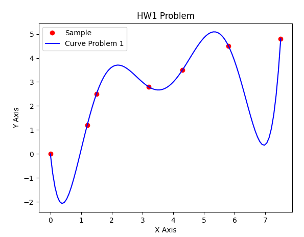
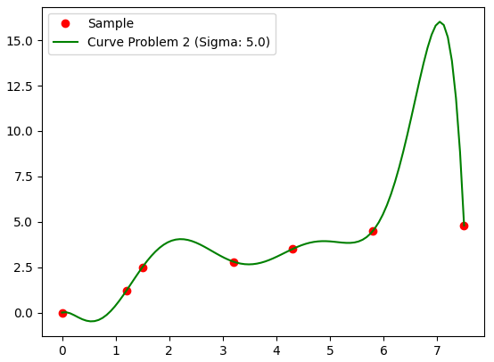
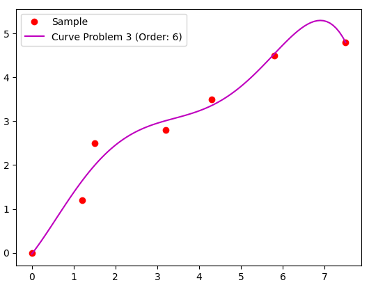
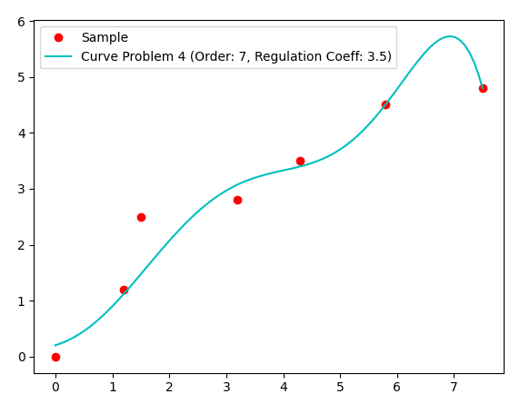
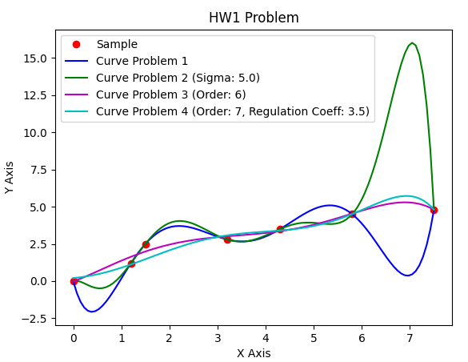
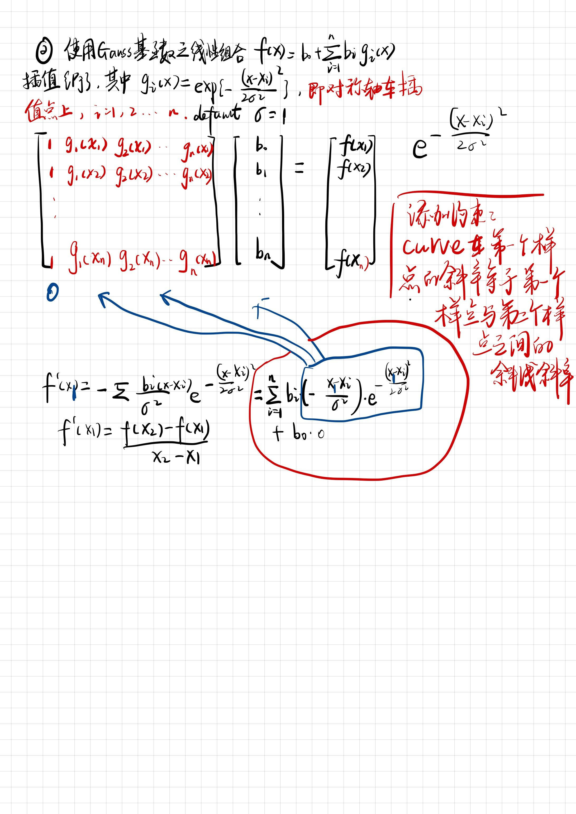
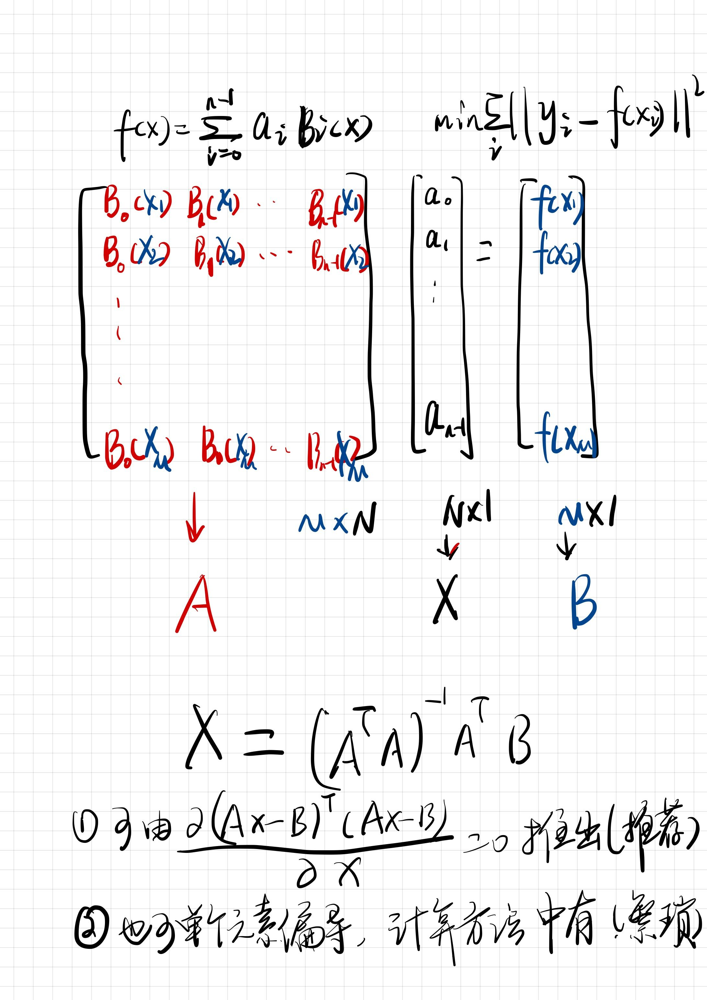
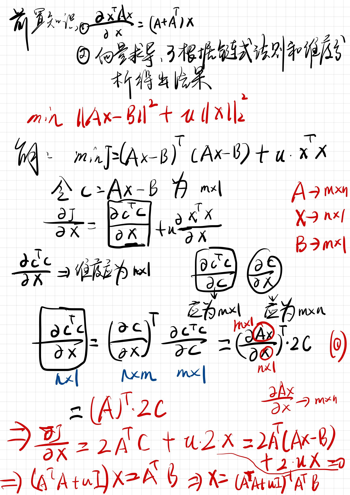

# HW1 

## Content

- Result
- Mathematical derivation

## Result

### Problem 1

Here, we could see it exactly pass through every sample point

### Problem 2

sigma value is 5.0

### Problem 3

Fitted order is 6, it is very close but could not pass through every sample point

### Problem 4

If there is no regularization term, the curve will pass through every sample point.

However, the regularization term relax the condition

### Comparison

To make it more clear, I draw them all in one figure, we could see:

- Overfitting problem occured in Problem 1&2, which means it "created" some abnormal data at some area. ***It is easy to generate overfitting result when we want to make the curve (the same for surface) to pass through every sample point***
- In some cases, when overfitting problem always happen, add an extra relaxing term called regularization term. (***Problem 4***)

## Mathematical derivation

### Problem 1

This problem is easy to be calculated

### Problem 2

we add one extra condition: 

**make the tangent of curve at first sample point equals to the slope of first and second sample point**

### Problem 3

### Problem 4

